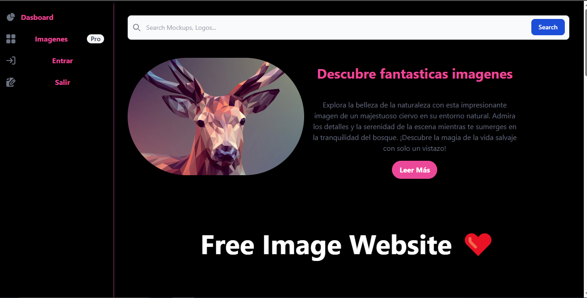
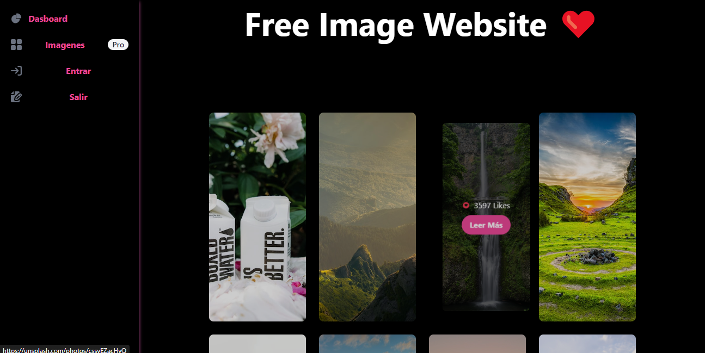
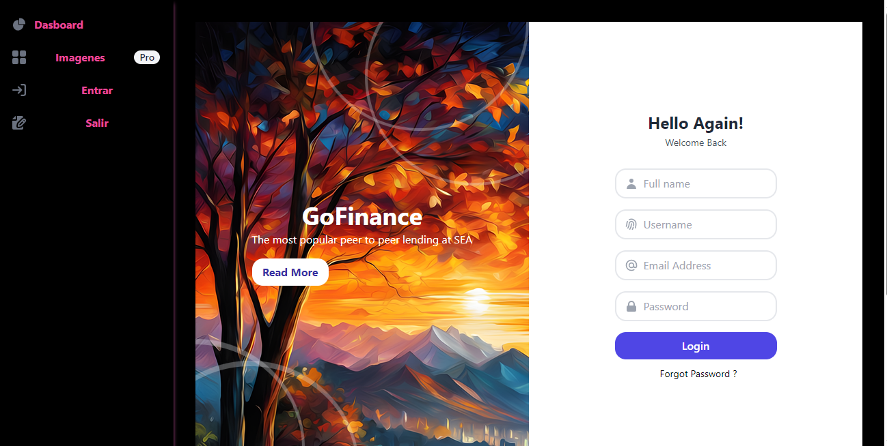
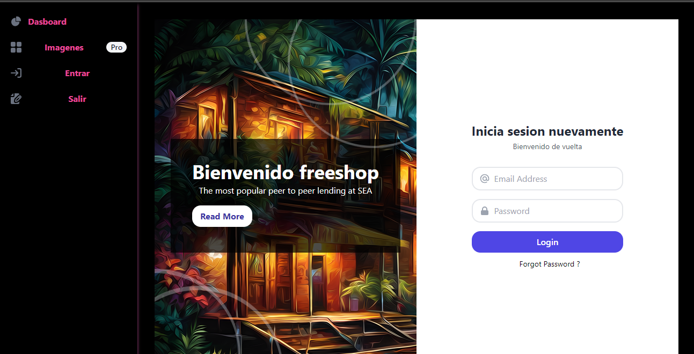

# Sitio web de imágenes gratuitas

Este es un sitio web simple que permite a los usuarios buscar y ver imágenes gratuitas. Las imágenes son proporcionadas por Unsplash, un sitio web de fotos de archivo gratuito.

## Tecnologías utilizadas

* **Frontend:** Tailwind CSS, TypeScript, Express, EJS
* **Backend:** MySQL

## Características

* Búsqueda de imágenes por palabra clave
* Ver los detalles de una imagen, incluido el fotógrafo y la licencia
* Guardar imágenes en tu computadora

## Cómo empezar

**Requisitos:**

* Node.js
* Git
* express
* taiwling
* ejs
* path
* mysql2
* path

**Instalación:**

1. Clona el repositorio de GitHub:

Utiliza el código con precaución. Más información

```
git clone https://github.com/[tu-usuario]/sitio-web-imagenes-gratis.git
```

2. Instala las dependencias:

```bash
cd sitio-web-imagenes-gratis
npm install
```

**Ejecución:**

```bash
npx tsc para convertir typescript en js
node dist/app.js ejecutar el servidor
```

El sitio web se abrirá en tu navegador en la dirección http://localhost:3000.

## Contribuciones

Este proyecto es de código abierto y se aceptan contribuciones. Si encuentras algún error o tienes alguna sugerencia, abre un problema en GitHub.

## Licencia

Este proyecto está licenciado bajo la Licencia MIT.

## Capturas de pantalla







## Créditos

Juan Pablo castillo velasquez
